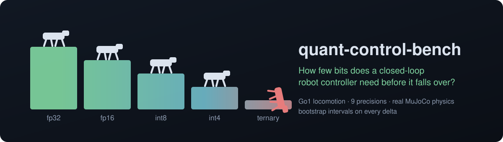
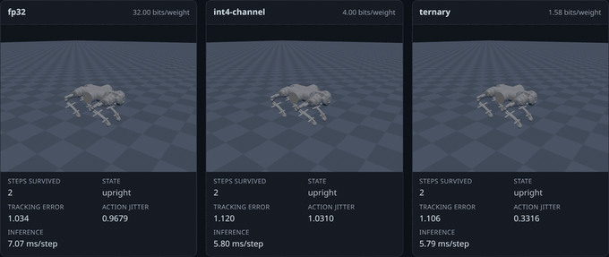
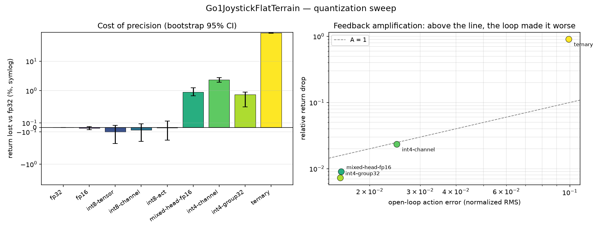
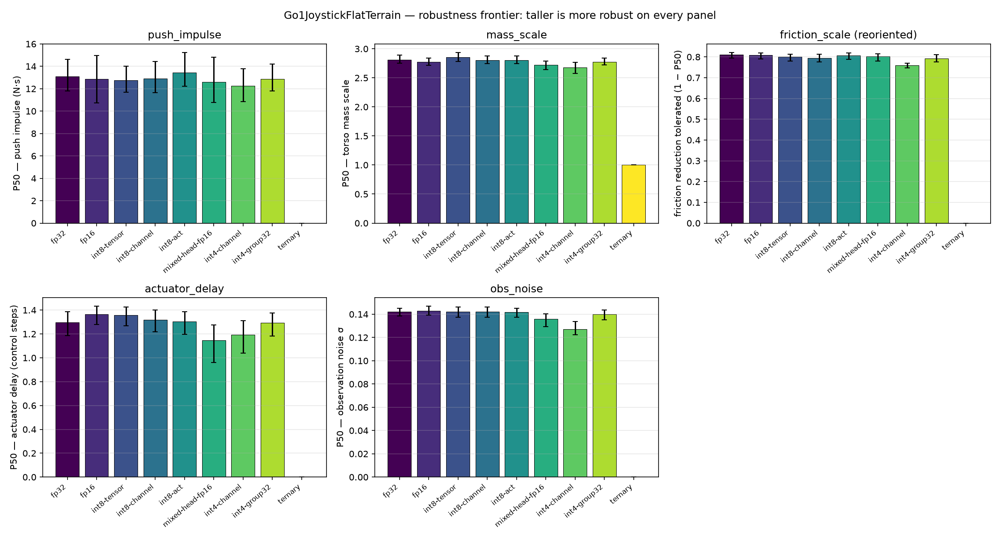

<p align="center">
  
</p>

<p align="center">
  <a href="https://huggingface.co/spaces/happynood/quant-control-bench-demo"><b>Live demo</b></a> ·
  <a href="https://huggingface.co/happynood/quant-control-bench-policies"><b>Policies</b></a> ·
  <a href="docs/methodology.md"><b>Methodology</b></a> ·
  <a href="docs/reproduce.md"><b>Reproduce</b></a>
</p>

<p align="center">
  
</p>

<p align="center"><sub>
Three precisions of one policy in real MuJoCo physics, in the browser. Same initial state, same command, and the same 8&nbsp;N·s push partway through — the benchmark's own perturbation axis, at a magnitude where fp32 succeeds 88% of the time and ternary 0%. fp32 and int4 take it and keep walking; ternary was already failing to follow the command at all (tracking error 1.0 against their 0.2) and goes over. Fallen robots freeze where they land.
</sub></p>

Post-training quantization of language models is well studied. Quantization of *control policies* is not, and the error dynamics are different in kind.

In a language model, quantization error is applied once per token and does not feed back into the input distribution. In a closed-loop controller it is recycled through the plant at every timestep — `δa_t → δs_{t+1} → δa_{t+1} → …` — so a bounded per-step action error can in principle produce unbounded trajectory divergence.

This benchmark measures how far that actually goes, on a quadruped, in real MuJoCo physics, on a 4 GB consumer GPU. Every number below comes from a run that completed on the reference machine. Nothing is estimated, extrapolated or projected, and cells for runs that did not happen stay marked `n/a (not run)`.

## What it found

| | claim | verdict on `Go1JoystickFlatTerrain` |
|---|---|---|
| **H1** | open-loop action error mispredicts closed-loop performance | **not supported** on flat terrain. Every scheme whose per-step action error stays under 1% of the action range costs nothing measurable, and the feedback amplification factor is `A ≤ 1` everywhere except one scheme whose error is ten times that bar. |
| **H2** | minimum viable precision rises under domain shift | **partly supported**, on 2 of 5 perturbation axes — and the boundary sits between int8 and int4, not between fp32 and int8. |
| **H3** | the action head dominates sensitivity | **supported**: holding it at fp16 recovers most of int4's loss. But a cheaper control beats it — finer grouping at the same 4 bits does better for fewer bits. |
| **H4** | quantizing observation-normalization statistics is disproportionately damaging | **supported by a wide margin**. They are 0.05% of the parameters; quantized like the weights, every int8 scheme becomes measurably lossy and every 4-bit scheme stops producing finite actions at all. |

**The short prescriptive answer.** int8 is free — on return and on all five robustness axes. At 4 bits, *how the scales are grouped* matters more than the bit width. Never quantize the normalization statistics with the same scheme as the weights. And a policy that looks fine on flat ground can still have lost robustness margin, so measure the frontier, not just the return.

## Results

### Tier 1 quantization sweep — `Go1JoystickFlatTerrain`

The headline environment: a quadruped that can actually fall over. 100 episodes × 5 fixed seeds, 1000-step horizon, deterministic policy. Return deltas are paired bootstrap 95% intervals over 10 000 resamples; failure rates are Wilson 95% intervals.

| scheme | bits/weight | mean return | Δreturn vs fp32 (95% CI) | failure rate (Wilson 95%) | open-loop RMS | T_div (ε=0.1) | A |
|---|---|---|---|---|---|---|---|
| `fp32` | 32.00 | 31.65 | +0.000% [+0.000%, +0.000%] | 0.2% [0.0%, 1.1%] | 0.00e+00 | 1000 / 1000 | n/a |
| `fp16` | 16.00 | 31.65 | +0.018% [−0.016%, +0.051%] | 0.2% [0.0%, 1.1%] | 2.85e-05 | 5 | n/a (no measurable loss) |
| `int8-tensor` | 8.00 | 31.68 | +0.097% [−0.049%, +0.362%] | 0.0% [0.0%, 0.8%] | 2.24e-03 | 2 | n/a (no measurable loss) |
| `int8-channel` | 8.00 | 31.66 | +0.058% [−0.083%, +0.311%] | 0.0% [0.0%, 0.8%] | 1.15e-03 | 2 | n/a (no measurable loss) |
| `int8-act` | 8.00 | 31.65 | +0.011% [−0.141%, +0.280%] | 0.0% [0.0%, 0.8%] | 8.14e-03 | 1 | n/a (no measurable loss) |
| `int4-group32` | 4.00 | 31.42 | **−0.728%** [−0.884%, −0.454%] | 0.0% [0.0%, 0.8%] | 1.58e-02 | 1 | 0.5 |
| `mixed-head-fp16` | 4.19 | 31.36 | **−0.902%** [−1.258%, −0.704%] | 0.4% [0.1%, 1.4%] | 1.59e-02 | 1 | 0.6 |
| `int4-channel` | 4.00 | 30.91 | **−2.336%** [−2.791%, −1.946%] | 0.4% [0.1%, 1.4%] | 2.49e-02 | 1 | 0.9 |
| `ternary` | 1.58 | 2.95 | **−90.672%** [−92.141%, −89.130%] | **93.4%** [90.9%, 95.3%] | 9.92e-02 | 1 | **9.1** |

`A` is quoted only where the return drop's own interval excludes zero. Where it does not, the numerator is indistinguishable from zero and the ratio would be noise dressed as a measurement — `fp16` computes to −6.4, which means nothing.



Raw data: [`results/tier1_sweep.json`](results/tier1_sweep.json).

**H1 is not supported on flat terrain.** The hypothesis requires a precision whose per-step action error stays under 1% of the action range *while episodic return collapses*. No scheme does both. Every scheme under the 1% bar — `fp16`, `int8-channel`, `int8-tensor`, `int8-act` — costs nothing measurable, and the one collapse, `ternary`, sits at 9.9% open-loop error, ten times above the bar. `A ≤ 1` everywhere except `ternary`. On the nominal task the feedback loop damped quantization error rather than amplifying it. Whether this survives domain shift is what the robustness frontier tests, and that is the point of H2.

**H3 is supported.** Holding the action head at fp16 while the trunk goes to int4 costs −0.902% [−1.258%, −0.704%] against `int4-channel`'s −2.336% [−2.791%, −1.946%] — non-overlapping intervals, for 0.19 extra bits per weight. Note the cheaper control: plain `int4-group32` reaches −0.728% at a flat 4.00 bits, so on this task finer *grouping* buys more than protecting the head does.

**Failure rate finally resolves.** On Cartpole every scheme scored 0.0% because the balance task never terminates — a collapsed policy still looked perfect. Go1 falls: `ternary` fails 93.4% of episodes.

**`int4-group32` is a separate measurement here.** On Tier 0 it came out bit-identical to `int4-channel`, because every layer's input width was 5 or 32 and one group spanned the whole reduction axis. Go1's layers are wider, so the grouping does real work and the two rows differ.

**The divergence horizon needs a different threshold than Tier 0.** The headline ε=0.1 saturates at 1–5 steps here: a gait has a large per-DOF spread, so trajectories separate almost immediately even at fp16. The ladder evaluated in the same pass separates the schemes cleanly at ε=10:

| scheme | ε=0.01 | ε=0.1 | ε=1 | ε=10 | ε=100 |
|---|---|---|---|---|---|
| `fp32` | 1000 | 1000 | 1000 | **1000** | 1000 |
| `fp16` | 2 | 5 | 11 | **274** | 1000 |
| `int8-channel` | 1 | 2 | 7 | **240** | 1000 |
| `int8-tensor` | 1 | 2 | 5 | **224** | 1000 |
| `int8-act` | 1 | 1 | 4 | **186** | 1000 |
| `mixed-head-fp16` | 1 | 1 | 2 | **110** | 1000 |
| `int4-group32` | 1 | 1 | 2 | **101** | 1000 |
| `int4-channel` | 1 | 1 | 2 | **83** | 1000 |
| `ternary` | 1 | 1 | 1 | **16** | 75 |

The ordering at ε=10 is monotone in precision, and `fp32` against itself gives the full horizon at every threshold — the self-consistency check, which is only meaningful now that GPU kernels are deterministic.

### The precision recommender

The prescriptive deliverable: given a robustness requirement and a per-step latency budget, name the cheapest precision that meets both.

```bash
uv run qcb recommend --sweep results/tier1_sweep.json \
    --frontier results/tier1_frontier_push_impulse.json \
    --frontier results/tier1_frontier_mass_scale.json \
    --frontier results/tier1_frontier_friction_scale.json \
    --frontier results/tier1_frontier_actuator_delay.json \
    --frontier results/tier1_frontier_obs_noise.json \
    --retain 0.9
```

| must retain (of the fp32 frontier, every axis) | cheapest qualifying scheme | bits/weight | binding axis |
|---|---|---|---|
| ≥ 90% | `int4-group32` | 4.00 | friction, at 97.8% |
| ≥ 95% | `int4-group32` | 4.00 | friction, at 97.8% |
| ≥ 99% | `int8-act` | 8.00 | friction, at 99.5% |

At the 90% bar the two 4-bit schemes separate cleanly, which is the recommender earning its keep: `int4-group32` qualifies while `int4-channel` — the same 4.00 bits — is rejected at 89.3% on observation noise, and `mixed-head-fp16` is rejected at 88.2% on actuator delay while costing *more* bits (4.19).

Raw output: [`retain90`](results/tier1_recommendation_retain90.json) · [`retain95`](results/tier1_recommendation_retain95.json).

Three properties worth stating:

- **The requirement binds on the worst axis, not the average.** A controller that keeps all of its push margin and half of its friction margin has a friction problem, not a 75% score.
- **Retention is measured on tolerated perturbation, not raw `P50`.** On `friction_scale`, swept downward, a ratio of raw `P50` would rank the *worst* scheme highest.
- **A latency budget without a measurement is refused, not ignored.** Browser latency has to come from a real browser on the target machine, so `--max-latency-ms` without `--latency` is a hard error rather than a silently dropped constraint.

`--conservative` requires the *lower* end of the retention interval to clear the bar instead of the point estimate. At 95% conservative, nothing but `fp32` qualifies — the intervals on `actuator_delay` are wide enough that no quantized scheme can be shown to hold 95% of the baseline margin there. That interval propagates only the candidate's uncertainty and treats the baseline `P50` as exact, which understates the true spread; a properly paired interval would need per-episode resampling of both policies together, which the stored frontier results do not carry.

### H4 — quantizing the observation-normalization statistics

The same sweep with `--quantize-obs-norm`, which sends the running mean and variance through the scheme's own quantizer alongside the weights. That is **96 values against 191,488 weights — 0.050% of the parameters.**

| scheme | bits/weight | mean return | Δreturn vs fp32 (95% CI) | open-loop RMS |
|---|---|---|---|---|
| `fp32` | 32.00 | 31.65 | +0.000% [+0.000%, +0.000%] | 0.00e+00 |
| `fp16` | 16.00 | 31.64 | −0.033% [−0.066%, −0.000%] | 5.59e-05 |
| `int8-tensor` | 8.00 | 31.49 | −0.483% [−0.648%, −0.198%] | 1.18e-02 |
| `int8-act` | 8.00 | 31.45 | −0.623% [−0.797%, −0.335%] | 1.35e-02 |
| `int8-channel` | 8.00 | 31.44 | −0.649% [−1.062%, −0.274%] | 1.16e-02 |
| `int4-channel` | 4.00 | **collapsed: NaN actions** (25 of 48 scales quantized to zero) | — | — |
| `int4-group32` | 4.00 | **collapsed: NaN actions** (25 of 48) | — | — |
| `mixed-head-fp16` | 4.19 | **collapsed: NaN actions** (25 of 48) | — | — |
| `ternary` | 1.58 | **collapsed: NaN actions** (34 of 48) | — | — |

Raw data: [`results/tier1_sweep_obsnorm.json`](results/tier1_sweep_obsnorm.json).

**H4 is supported, and by a wide margin.** Side by side with the weight-only sweep:

| scheme | weights only | + normalization stats |
|---|---|---|
| `fp16` | +0.018% [−0.016%, +0.051%] | −0.033% [−0.066%, −0.000%] |
| `int8-tensor` | +0.097% [−0.049%, +0.362%] | −0.483% [−0.648%, −0.198%] |
| `int8-channel` | +0.058% [−0.083%, +0.311%] | −0.649% [−1.062%, −0.274%] |
| `int8-act` | +0.011% [−0.141%, +0.280%] | −0.623% [−0.797%, −0.335%] |
| `int4-group32` | −0.728% [−0.884%, −0.454%] | collapsed |
| `int4-channel` | −2.336% [−2.791%, −1.946%] | collapsed |

Every int8 variant goes from "no measurable loss" to a loss whose interval excludes zero, and every scheme at 4 bits or below stops producing finite actions at all. Note also that `int8-channel`'s advantage over `int8-tensor` disappears: with the statistics quantized, the open-loop error is set by them (1.16e-02 vs 1.18e-02) rather than by the weight scaling scheme.

**The mechanism, and a deliberate non-fix.** `norm_std` is a divisor and is strictly positive by construction. The weight schemes are symmetric and signed, which is the wrong shape for it twice over: half the range is spent on values the tensor never takes, and small entries round to zero. A zero divisor is not graceful degradation — the observation becomes infinite and the policy emits NaN.

Choosing an unsigned or log-domain quantizer for this one tensor is the obvious engineering fix, and a deployment should do it. It is deliberately *not* done here: H4 asks what happens when the normalization statistics are quantized the same way as everything else, and the collapse is the answer. Swapping the quantizer to obtain a presentable number would be changing the experiment.

`mixed-head-fp16` collapses too, which is worth stating separately: holding the action head at fp16 does nothing for this failure, because the statistics follow the trunk's quantizer. Protecting the output layer does not protect the input transform.

### Tier 1 robustness frontier — `Go1JoystickFlatTerrain`

`P50` is the perturbation magnitude at which the success rate crosses 50%. An episode succeeds if it reached the horizon without falling, its return was finite, and that return was at least half the fp32 baseline's unperturbed return — the same bar for every scheme. 100 episodes per grid point, 2000-resample bootstrap intervals.

**Read the direction per column.** `friction_scale` is swept *downward* from 1.0, so a larger number there means the policy gave up sooner. Every other axis is swept upward, where larger is better. (The figure reorients friction so that taller always means more robust; the table keeps the raw quantity.)

| scheme | `push_impulse` (N·s) | `mass_scale` (×) | `friction_scale` (×, ↓ better) | `actuator_delay` (steps) | `obs_noise` (σ) |
|---|---|---|---|---|---|
| `fp32` | 13.100 [11.800, 14.615] | 2.811 [2.750, 2.891] | 0.189 [0.178, 0.206] | 1.299 [1.186, 1.387] | 0.142 [0.138, 0.145] |
| `fp16` | 12.875 [10.727, 14.960] | 2.774 [2.714, 2.840] | 0.192 [0.181, 0.210] | 1.365 [1.279, 1.432] | 0.143 [0.139, 0.147] |
| `int8-tensor` | 12.750 [11.682, 14.000] | 2.853 [2.780, 2.939] | 0.200 [0.186, 0.219] | 1.356 [1.269, 1.427] | 0.142 [0.137, 0.146] |
| `int8-channel` | 12.909 [11.667, 14.414] | 2.805 [2.746, 2.876] | 0.205 [0.188, 0.224] | 1.319 [1.217, 1.400] | 0.142 [0.138, 0.146] |
| `int8-act` | 13.429 [12.235, 15.250] | 2.805 [2.746, 2.879] | 0.193 [0.180, 0.213] | 1.304 [1.197, 1.387] | 0.142 [0.138, 0.145] |
| `int4-group32` | 12.875 [11.782, 14.200] | 2.777 [2.720, 2.842] | 0.207 [0.190, 0.225] | 1.294 [1.183, 1.377] | 0.140 [0.135, 0.144] |
| `mixed-head-fp16` | 12.615 [10.769, 14.800] | 2.720 [2.645, 2.787] | 0.198 [0.185, 0.220] | 1.145 [0.962, 1.277] | 0.136 [0.129, 0.141] |
| `int4-channel` | 12.263 [10.842, 13.786] | 2.675 [2.578, 2.765] | **0.241** [0.230, 0.252] | 1.193 [1.040, 1.313] | **0.127** [0.122, 0.134] |
| `ternary` | 0.000 | 1.000 | 1.000 | 0.000 | 0.000 |



Raw data: [`results/tier1_frontier_*.json`](results/), table: [`results/tier1_frontier_table.md`](results/tier1_frontier_table.md).

**H2 is partly supported, and the threshold is not where it was expected.** Exactly one scheme other than `ternary` separates from fp32 with non-overlapping 95% intervals, and only on two of the five axes:

- **`friction_scale`**: `int4-channel` gives up at 0.241 [0.230, 0.252] against fp32's 0.189 [0.178, 0.206]. At the 0.20 grid point the raw success rates are 57% for fp32, 47% for `int4-group32` and 26% for `int4-channel` — a ~6σ gap in a single measured point, not an interpolation artifact.
- **`obs_noise`**: `int4-channel` breaks at σ = 0.127 [0.122, 0.134] against fp32's 0.142 [0.138, 0.145].

That is the H2 mechanism: `int4-channel` costs only 2.3% of return on flat terrain, yet it measurably loses robustness margin once the world stops matching training. But the boundary sits **between int8 and int4, not between fp32 and int8** — every int8 variant is indistinguishable from fp32 on all five axes, and `int4-group32` is indistinguishable from fp32 on four of five. Finer grouping, not more bits, is what buys the margin back.

`ternary` fails at the first grid point of every axis: it cannot clear the shared threshold even unperturbed, so its zeros describe a broken policy rather than a robustness measurement.

**Two axes could not resolve the question.** On `push_impulse` the intervals are ±1.4 N·s wide while the scheme-to-scheme spread is 0.3–0.8 N·s, so an effect of the size seen on friction would be invisible; resolving it would need roughly 20× the episodes, about 80 GPU-hours instead of four. On `actuator_delay` the delay is `round(magnitude)` control steps, so the axis is integer-valued and every crossing lands between 1 and 2 steps regardless of precision. Both are reported as "not resolved at this sample size", which is not the same as "no effect".

### Tier 0 quantization sweep — `CartpoleBalance`

The smoke tier, kept for contrast rather than as a result: CartpoleBalance saturates near a return of 1000 and every scheme but `ternary` sits within 0.15% of it. This is what a task that cannot fail looks like, and it is why the headline environment is a robot that falls over.

100 episodes × 5 fixed seeds, 1000-step horizon, deterministic policy. Return deltas are paired bootstrap 95% intervals over 10 000 resamples; failure rates are Wilson 95% intervals. `A` is the feedback amplification factor.

| scheme | bits/weight | mean return | Δreturn vs fp32 (95% CI) | open-loop RMS | T_div (ε=1) | A |
|---|---|---|---|---|---|---|
| `fp32` | 32.00 | 998.94 | — | 0 | 1000 | n/a |
| `fp16` | 16.00 | 998.94 | −0.000% [−0.000%, −0.000%] | 5.81e-05 | 1000 | 0.0 |
| `int8-tensor` | 8.00 | 998.91 | −0.003% [−0.003%, −0.003%] | 1.31e-03 | 1000 | 0.0 |
| `int8-channel` | 8.00 | 998.91 | −0.003% [−0.004%, −0.003%] | 7.74e-04 | 1000 | 0.0 |
| `int8-act` | 8.00 | 998.72 | −0.023% [−0.023%, −0.022%] | 1.57e-02 | 162 | 0.0 |
| `mixed-head-fp16` | 4.23 | 998.35 | −0.060% [−0.065%, −0.054%] | 1.69e-02 | 37 | 0.0 |
| `int4-channel` | 4.00 | 997.52 | −0.142% [−0.155%, −0.130%] | 2.47e-02 | 12 | 0.1 |
| `int4-group32` | 4.00 | 997.52 | −0.142% [−0.155%, −0.130%] | 2.47e-02 | 12 | 0.1 |
| `ternary` | 1.58 | 269.05 | **−73.067%** [−73.363%, −72.744%] | 3.73e-02 | 1 | **19.6** |

Failure rate is 0.0% [0.0%, 0.8%] for every scheme, including `ternary` — the balance task never terminates, so a policy that has stopped working still scores a perfect failure rate. Action jitter catches it instead, at 46× the fp32 value.

Two things this table is not evidence for. `int4-group32` is bit-identical to `int4-channel` here, because every layer's input width is 5 or 32 and a group of 32 spans the whole reduction axis; the rows are one measurement, not two. And `A ≈ 19.6` for `ternary` is a single point far outside the regime H1 is about — a genuine test needs a scheme whose open-loop error is small while its return collapses, which Cartpole does not provide.

Raw data: [`results/tier0_sweep.json`](results/tier0_sweep.json); the Tier 0 robustness frontier is in [`results/tier0_frontier.json`](results/tier0_frontier.json).

### Baselines

**Tier 0 — `CartpoleBalance`, fp32 baseline**

| | |
|---|---|
| Training | Brax PPO, MuJoCo Playground tuned config, seed 0 |
| Environment steps executed | 88,473,600 |
| Wall clock | 72.3 min |
| Peak VRAM | 927 MiB |
| Final training reward | 998.76 ± 1.33 |
| Weight-extraction agreement with Brax | 2.62e-06 max abs action delta |
| ONNX parity (1000 observations) | 3.13e-06 max abs action delta |

**Deterministic evaluation**, 100 episodes per seed over 5 fixed seeds, full 1000-step horizon:

| seed | mean return | failure rate | action jitter |
|---|---|---|---|
| 0 | 999.092 | 0.0% | 0.0005 |
| 1 | 999.008 | 0.0% | 0.0004 |
| 2 | 998.808 | 0.0% | 0.0004 |
| 3 | 998.961 | 0.0% | 0.0004 |
| 4 | 998.851 | 0.0% | 0.0005 |
| **mean** | **998.944** | **0.0%** | — |

Raw per-episode data: [`results/tier0_cartpole_fp32.json`](results/tier0_cartpole_fp32.json).

Note on the training budget: Playground's tuned config declares 60M timesteps, but Brax rounds the request up to whole epochs, so the run executed 88,473,600. Records store the request and the executed total separately — see [`docs/methodology.md`](docs/methodology.md).

## Browser demo

`web/` is a static page that runs the whole thing client-side: real MuJoCo physics compiled to WebAssembly, the exported ONNX policies under `onnxruntime-web`, and three.js rendering geometry read straight out of the compiled model. Several precisions run side by side from a shared initial state with a shared command, and the perturbation sliders drive the same axes the benchmark sweeps.

The deployed Space loads its weights from the [model repo](https://huggingface.co/happynood/quant-control-bench-policies) rather than from a bundled copy, so there is exactly one source of truth for them.

```bash
uv run qcb export-scene --out web/assets/scene   # scene + the env's post-parse overrides
cd web && npm install
python3 -m http.server 8765                      # then open http://127.0.0.1:8765
node tools/browser_check.mjs --mode smoke        # headless smoke, parity or latency
```

**Python ↔ browser parity.** Both sides step the same exported model with the same scripted actions and no observation noise, so only the engines differ:

| | max abs `qpos` difference |
|---|---|
| immediately after reset | **0.000e+00** |
| after 1 control step | 6.8e-04 |
| after 10 | 4.2e-02 |
| after 100 | 8.8e-02 |

The zero at reset is what matters — models, overrides and initial state agree exactly, so the divergence is the integrators alone. The browser runs MuJoCo **3.3.8** (the published WASM package) against **3.10.0** in Python, and contact-rich dynamics amplify the gap quickly. The demo re-runs the same model and policy; it does not replay a benchmarked trajectory, and no number in the tables above is produced in a browser. Raw data: [`results/browser_parity.json`](results/browser_parity.json).

**Observation parity.** Physics parity replays scripted actions and never builds an observation, which hid a real defect: `get_gravity` is not the `upvector` sensor but the world down-vector rotated into the IMU *site* frame. Reading the sensor inverted 3 of the 48 observation entries — the policy's orientation signal — so it was told the robot was upside down and stopped walking, covering 0.02 m in five seconds against a 1.0 m/s command while every physics check stayed green. Fixed, the same five seconds cover 4.77 m. The browser's vectors are now compared against the environment's own accessors: exactly 0.00e+00 at rest, and ≤3.2e-02 at a displaced state, which is the same 3.3.8-vs-3.10.0 version gap rather than float32 (the float64 C engine reproduces the MJX numbers).

**Inference latency**, measured in the browser, 1000 timed iterations after 100 warmup: **0.033–0.053 ms per step** across the nine schemes, against a 20 ms control period. Timed in blocks of 50 because a single forward pass is faster than the browser's 100 µs timer granularity — per-call quantiles are not resolvable and are deliberately not reported. The spread between schemes is the same size as the block-to-block noise and is not a ranking: quantization here is simulated, so every graph stores float32 weights. Raw data: [`results/browser_latency.json`](results/browser_latency.json).

The HUD reports steps survived, whether the robot fell, action jitter and inference time — all exact. It deliberately does **not** show episodic return: that is a sum of 16 environment-specific terms, and a JavaScript reimplementation would produce a number that looks like the benchmark's and is not it. Measured returns appear in the results panel, from the recorded runs.

## Reference machine

| | |
|---|---|
| GPU | NVIDIA GeForce RTX 3050 Laptop, 4096 MiB |
| Driver | 595.71.05 |
| Physics | MuJoCo Playground 0.2.0, MJX (JAX backend) |
| JAX | 0.9.2, CUDA 12 |
| Python | 3.12 |

Measured on this machine, both tiers train at MuJoCo Playground's tuned `num_envs` inside the 4 GB budget — Tier 0 (`CartpoleBalance`) at 2048 envs and 927 MiB peak, Tier 1 (`Go1JoystickFlatTerrain`) at 8192 envs and 2225 MiB peak. The VRAM protocol never needed to halve, and the reduced-scale fallback tier is not in use.

**Tier 1 baseline** (`Go1JoystickFlatTerrain`, seed 0): 206,438,400 environment steps in 140 min, final training reward 31.772 ± 1.810, deterministic evaluation mean return 31.645 over 100 episodes × 5 seeds, ONNX parity 2.891e-06. Per-episode data: [`results/tier1_go1_fp32.json`](results/tier1_go1_fp32.json).

## Quick start

```bash
uv sync --all-extras
make env-check      # prints the accelerator and simulator stack in use
make verify         # lint, format, types, tests, end-to-end smoke pipeline
```

`make verify` must be green before every push.

## Design notes

- **Physics backend is pinned to MJX/JAX**, in one place (`src/quant_control_bench/envs/registry.py`). Rollouts must be bit-reproducible for the divergence-horizon metric, so no call site is allowed to pick a different implementation.
- **Every result carries a manifest**: config hash, git commit and dirty flag, pinned simulator versions, seeds, and the hardware it ran on.
- **Deterministic evaluation only**: mean action, no sampling, fixed seeds and fixed environment RNG — the control analogue of `temperature=0`.
- **Bootstrap 95% CI on every headline delta**, 10 000 resamples, percentile method.
- **True float32 matmuls are forced.** JAX's default on this GPU truncates float32 to a bfloat16 mantissa, which would make the fp32 baseline itself quantized and inject roughly the same action error that weight quantization is supposed to introduce. See [`docs/methodology.md`](docs/methodology.md).
- **Deterministic GPU kernels are forced.** Without them, two identical Go1 rollouts disagreed on all 100 of 100 episodes, the baseline diverged from itself at step 6 of 1000, and fp32 scored a non-zero delta against itself. Contact-rich MJX dynamics accumulate through non-deterministic atomics; Cartpole is unaffected, which is why the Tier 0 test suite never caught it.

## License

MIT. See [LICENSE](LICENSE).
